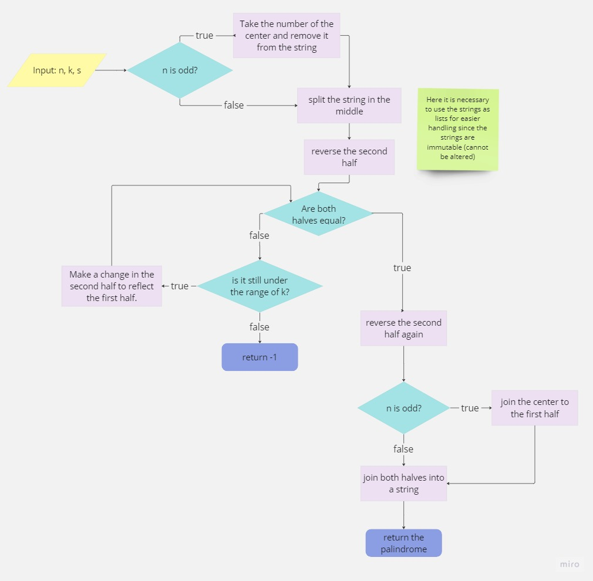

# Tul Intern Test
## Why I chose this exercise
1. In the past I tried to solve it and I couldn't, I wanted to see my progress.
2. I started solving it and got to the end.
3. It looked fun :)

## How I solved it
1. Separate in two different parts the final task: create a function that reads the user input and another one that works with this input to return the desired data.
2. I focus on the main function: highestValuePalindrome
3. I made a small flowchart + pseudocode to understand how the program needed to be executed to work correctly, something like this:

4. I started writing code based on what I understood in the previous step while testing that the solutions I had thought of worked the way it needed to work.
5. I gave my attention to the way the main function acquired its parameters, so I made an alternate function: read_input
6. I checked the indicated way in which the function should receive the parameters and adapted them to my function.
7. I made different tests from the console to verify that everything was working correctly.


## Funtions

|  Function       | Description                                            
|----------------|-------------------------------|
|read_input() |	Reads the input needed for the 			highestValuePalindrome function to execute           |
|highestValuePalindrome()          |Create a palindrome string representation          |


## Execution instructions (and example)

1.  Clone the repository locally  
```
$ git clone https://github.com/aike-s/Tul-Intern-Test.git
```
2. Run the highestValuePalindrome.py file
```
$ python3 highest_value_palindrome.py 
```
3. It will prompt you for the necessary parameters for the highestValuePalindrome function to work:
	- In the first line, type the length of the string and the maximum number of attempts allowed, separated by a space.
	```
	$ 4 1
	```
	- In the second line type the representation of integers for which to create the palindrome
	```
	$ 3943
	```
4. Finally the function will return the representation of the highest achievable value or -1
	```
	$ 3993
	```
